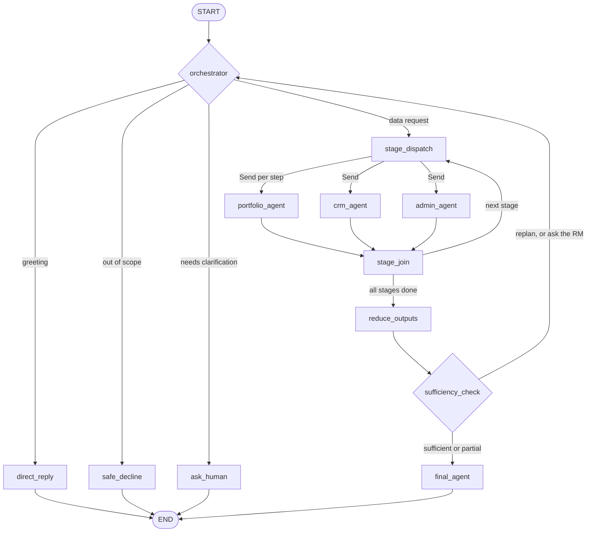

## rm-agent

Agentic FastAPI backend for Relationship Managers.

Primary goals:
- Answer RM questions about portfolios and client interactions.
- Support transcription/meeting summarization using retrieved CRM/portfolio context.
- Keep responses grounded in tool data with citations/evaluations.

---

## 1. Run the Application 

### A) Local dev run (recommended)

```powershell
uv run main.py
```


### B) Run with explicit server parameters

```powershell
python main.py --host 0.0.0.0 --port 8000 --reload --log-level debug
```

### C) Run with a specific env file

```powershell
python main.py --env-file .env.local --port 8010
```

### D) Uvicorn direct mode

```powershell
uvicorn main:app --reload --host 0.0.0.0 --port 8000
```

### E) Docker run

```powershell
docker build -t rm-agent .
docker run --rm -p 8000:8000 --env-file .env rm-agent
```

---

## 2. Command Parameters and Purpose

`main.py` supports:
- `--env-file`: load settings from a specific env file.
- `--host`: bind host interface.
- `--port`: bind port.
- `--log-level`: uvicorn level (`critical|error|warning|info|debug|trace`).
- `--debug`: force `DEBUG=true` for this run.
- `--reload`: force reload on.
- `--no-reload`: force reload off.

---

## 3. Switchable Concepts (Enable/Disable)

### LLM provider and model
- `LLM_PROVIDER=unique_ai|openai`. All models of one run are served by that provider.
- `unique_ai`: model from `UNIQUE_MODEL_NAME` (plus `UNIQUE_API_BASE_URL`, `UNIQUE_APP_ID`, `UNIQUE_APP_KEY`, `UNIQUE_COMPANY_ID`, `UNIQUE_USER_ID`).
- `openai`: OpenAI-compatible LLM as a service (LLMaaS); the client provides the key.
  - `LLMAAS_BASE_URL`: endpoint of the service (usually ends with `/v1`); required.
  - `LLMAAS_MODEL`: model name the service exposes; required.
  - `LLMAAS_API_KEY`: key provided by the client; required.
  - `LLMAAS_TEMPERATURE`, `LLMAAS_MAX_TOKENS`: generation settings.
  - Private networks: `SSL_CA_CERT_PATH` for an internal CA, `SSL_VERIFY=false` for self-signed certificates, `HTTP_PROXY`/`HTTPS_PROXY`/`NO_PROXY` for proxies.
  - Requires the extra: `pip install -e ".[openai]"`.
- `LLM_FALLBACK_MODELS` (optional, comma separated) adds fallback models tried in order on the same provider.
- Required settings of the active provider are checked at startup and missing ones are logged.
- Check the setup with `GET /agent/llm/models` and `POST /agent/llm/query` (section 6).

### Postgres on/off
- `POSTGRES_ENABLED=true|false`

Behavior:
- `true`: DB engine/session available; audit persistence uses DB.
- `false`: DB init/session CRUD are skipped safely; `/health` shows `postgresql=disabled`.

### DB startup strictness
- `DB_STARTUP_REQUIRED=true|false`

Behavior:
- `true`: app fails startup if DB init fails.
- `false`: app starts in degraded mode if DB is unreachable.

### Phoenix observability mode
- `PHOENIX_ENABLED=true|false`
- `PHOENIX_LOCAL_MODE=true|false`

Local mode:
- `PHOENIX_OTLP_ENDPOINT=http://127.0.0.1:6006/v1/traces`

Deployed mode:
- `PHOENIX_DEPLOYED_OTLP_ENDPOINT=...`
- `PHOENIX_SPACE_ID=...`
- `PHOENIX_API_KEY=...`
- Optional header name overrides:
	- `PHOENIX_SPACE_ID_HEADER`
	- `PHOENIX_API_KEY_HEADER`

### Unique webhook signature verification
- `UNIQUE_WEBHOOK_VERIFY_SIGNATURE=true|false`
- `UNIQUE_WEBHOOK_ENDPOINT_SECRET=...`
- `UNIQUE_WEBHOOK_EXPECTED_MODULE_NAME=...` (optional safety filter)

Behavior:
- `false` (default): signature verification is skipped for local testing.
- `true`: signature verification is enforced using `UNIQUE_WEBHOOK_ENDPOINT_SECRET`.
- If verification is enabled but secret is empty, webhook endpoint returns `503 verification_unavailable`.
- If `UNIQUE_WEBHOOK_EXPECTED_MODULE_NAME` is set, external-module events with different module names are ignored.

### Feature toggles
- `MCP_ENABLED`
- `GRAPH_CHECKPOINTER_ENABLED` (short-term memory: history and pending clarification, in-process for now)
- `AUDIT_ENABLED`
- `ENTITLEMENTS_ENABLED`
- `GUARDRAILS_ENABLED`
- `PII_MASKING_ENABLED`
- `LTM_ENABLED`

### Agent loop settings
- `MAX_AGENT_ITERATIONS`: reasoning steps per ReAct agent.
- `AGENT_MAX_REPLAN_LOOPS`: how many times the sufficiency check may send the flow back to the orchestrator.
- `AGENT_TOOL_TIMEOUT_SECONDS`, `AGENT_MAX_PARALLEL_TOOL_CALLS`: per-tool timeout and concurrency.
- `AGENT_EVIDENCE_MAX_CHARS_PER_SOURCE`: cap applied when tool output is rendered as evidence.
- `AGENT_STRUCTURED_OUTPUT_ATTEMPTS`: LLM attempts to produce valid JSON, with the validation error fed back each time.
- `ADMIN_AGENT_TIMEOUT_SECONDS`: timeout of the external administrative agent call.

---

## 4. Architecture: Multi-Agent LangGraph Workflow

Every RM message runs through one compiled LangGraph (`app/graph/builder.py`). Entry point: `run_turn()` in `app/graph/runner.py`.



Print the diagram from the compiled graph with `render_graph_mermaid()` in `app/graph/builder.py`.

### Nodes

| Node | Role |
|---|---|
| `orchestrator` | Phase-adaptive LLM decision: intent, entities, execution plan. |
| `direct_reply`, `safe_decline` | End the turn with the text the orchestrator wrote (greeting, polite decline). |
| `ask_human` | Ends the turn with the question as the reply; the pending question is saved for the next turn. |
| `stage_dispatch` / `stage_join` | Run the plan stage by stage; steps in one stage run concurrently (LangGraph `Send`). |
| `portfolio_agent`, `crm_agent` | ReAct agents: reason, call tools in parallel, observe, repeat (bounded). |
| `admin_agent` | One call to an external agent (Unique, placeholder for now). |
| `reduce_outputs` | Renders tool output as evidence text, truncates oversized outputs and numbers the sources. |
| `sufficiency_check` | One LLM judge: coverage, grounding, re-fetch instructions or a question for the RM. |
| `final_agent` | Writes the structured markdown answer; only the sources it cites are returned. |

### Execution modes

The plan is a list of stages. One stage with one step is single, one stage with several steps is parallel (independent data), and several stages is sequential (a later agent receives the findings of earlier ones).

### Orchestrator phases

The orchestrator uses one decision schema and a different prompt per phase (`app/prompts/orchestrator/`):

| Phase | When | Prompt |
|---|---|---|
| `routing` | Fresh RM message | `routing.py` |
| `clarification_followup` | The RM is answering a question asked on the previous turn | `clarification_followup.py` |
| `replan` | Sufficiency asked for a re-fetch | `replan.py` |
| `human_in_the_loop` | Sufficiency needs input only the RM has | `human_in_the_loop.py` |

The phase is derived from the state (`app/agents/orchestrator/phase.py`). Each phase also states what a valid decision looks like (for example, a replan may only name the agents in the re-fetch instructions).

### LLM-written text, no canned rules

Greetings, polite declines, clarification questions, re-fetch instructions and explanations of missing data are all written by the LLM in the relevant phase. There are no templated replies and no keyword routing fallback. Output is validated by Pydantic schemas; an invalid answer is sent back to the model with the validation error (`AGENT_STRUCTURED_OUTPUT_ATTEMPTS`). If the LLM stays unavailable the turn fails with an error instead of returning a canned answer.

The only deterministic controls are safety limits: the replan cap, the ReAct iteration cap, tool timeouts, and removal of citation markers the model invented.

### Human in the loop

When information is missing, the question is returned as the reply. The pending question is stored in the short-term memory snapshot, and the next message is handled in the `clarification_followup` phase.

### Project layout

```text
app/
  components/          reusable, project-independent code (see below)
  graph/               state, builder, edges, tasks, nodes/, runner
  agents/              orchestrator/, react_agent, admin_agent, sufficiency, final_agent, formatting
  prompts/             one file per use case; orchestrator/ has one file per phase plus the registry
  schemas/             Pydantic contracts with field descriptions
  tools/               placeholder integrations and the registry that selects them
  services/            LLM routing, citations, evaluation, tracing, Unique, webhook, SSE
  routes/              FastAPI routers
  constants.py         names, labels and fixed limits
  config.py            environment-driven settings
```

### Reusable components (`app/components/`)

These depend only on `langchain-core` and `pydantic`, so they can be copied into another project.

| Component | Use |
|---|---|
| `structured_output.py` | `invoke_structured(llm, messages, Schema, post_validate=...)`: JSON answer, Pydantic validation, repair retries. |
| `react/` | `ReActRunner(llm, tools, system_prompt=..., config=ReActConfig(...))`: bounded tool-calling loop with parallel calls, timeouts and duplicate-call protection. |
| `messages.py` | `extract_text` for model message content. |

### Integrations are placeholders

The portfolio, CRM and administrative tools in `app/tools/` return deterministic dummy text of 100 to 200 characters. To go live, change only `app/tools/registry.py`:
- `portfolio`: AAA MCP tools
- `crm`: Outlook MCP and Fano MCP tools
- `admin`: Unique external agent client

A provider only needs `get_tools() -> list[BaseTool]`; each tool returns a `ToolOutput` (`content` plus `sources`) so citations work unchanged.

### Adding another agent

1. Add its id, display name and capability to `app/constants.py` (`AGENT_*`, `AGENT_TO_NODE`, `AGENT_ORDER`) and to `AgentId` in `app/schemas/orchestrator.py`.
2. Create the agent (`ReActAgent(agent_id, system_prompt, tool_provider)` or a class with `run(task)`) and its prompt file, then register it in `app/graph/dependencies.py` and `app/graph/builder.py`.

### Testing

```powershell
python -m pytest
```

Graph tests use a scripted LLM (`tests/fakes.py`) keyed by prompt phrases, so every phase and loop is tested without a model.

---

## 4a. End-to-End Request Flow (Simple)

1. API receives the RM query (`/agent/chat`, `/agent/stream`) or a Unique webhook event.
2. Middleware attaches the correlation ID (`X-Correlation-ID`).
3. `run_turn` restores short-term memory and runs the graph.
4. The orchestrator replies directly, asks the RM a question, or produces an execution plan.
5. Agents run the plan stage by stage (parallel inside a stage).
6. Outputs are reduced to evidence text with numbered sources.
7. The sufficiency check either approves, loops back to the orchestrator (replan, or a question for the RM), or accepts gaps.
8. The final agent writes the markdown answer; cited sources and evaluations are returned with it.

---

## 5. What We Use and Why

### FastAPI
- REST and SSE endpoints.
- Health, stream, webhook, model utility APIs.

### LangGraph concepts
- `StateGraph` with conditional edges and `Send` fan-out for parallel agents (see section 4).
- Conversation history and pending clarification kept by the in-memory checkpointer (Postgres checkpointer is planned).

### Unique AI SDK (direct usage)
Used in these backend capabilities:
- `unique_sdk.ChatCompletion.create`: model invocation path in Unique provider wrapper.
- `unique_sdk.LLMModels.*`: list available Unique models.
- `unique_sdk.Webhook.construct_event`: webhook signature verification (when enabled).
- `unique_sdk.Message.modify/create`: write assistant response back to Unique chat.

### Unique Toolkit
- Not directly imported as runtime code path in this backend currently.
- MCP/tooling architecture is designed to integrate external tool ecosystems cleanly.

### Arize Phoenix + OpenTelemetry
- LLM tracing and metadata observability.
- Local or deployed collector modes supported.

### Observability coverage in this backend
Current tracing is not limited to one endpoint. The backend now emits spans across these layers:
- API boundary spans for `POST /agent/chat`, `POST /agent/stream`, and `POST /relationship-manager/webhook`
- Turn/workflow spans for the orchestrator lifecycle
- Node-level spans for every graph node (`graph.node.<name>`)
- Agent spans for the ReAct agents and the administrative external call
- Tool-call timings are recorded on each agent result
- LLM spans for router-managed providers and direct Unique SDK calls
- Webhook SDK spans for signature verification and assistant-message writeback
- Shutdown flush so buffered spans are exported on app stop

Implementation notes:
- Tracer bootstrap and exporter setup live in `app/services/observability.py`
- Reusable span helpers live in `app/services/tracing.py`
- New APIs should use the same pattern: request span -> service/workflow span -> node/tool/LLM spans

### Arize enterprise setup notes
For enterprise Arize AX usage on a client-managed environment:
- Set `PHOENIX_ENABLED=true`
- Set `PHOENIX_LOCAL_MODE=false`
- Set `PHOENIX_DEPLOYED_OTLP_ENDPOINT` to the enterprise collector endpoint
- Set `PHOENIX_SPACE_ID` and `PHOENIX_API_KEY`
- If your tenant requires custom auth header names, set `PHOENIX_SPACE_ID_HEADER` and `PHOENIX_API_KEY_HEADER`

Behavior:
- Local mode checks whether the local collector is reachable before enabling tracing
- Deployed mode does not perform the localhost reachability check
- If telemetry dependencies are missing, the app continues to run and tracing becomes a no-op
- If message capture is enabled, prompt/response text is attached to spans; otherwise only metadata and token counts are recorded

Recommended enterprise validation:
1. Start the app with enterprise Phoenix settings
2. Call `POST /agent/chat`
3. Call `POST /agent/stream`
4. Trigger `POST /relationship-manager/webhook`
5. Confirm traces appear in Arize with nested spans for request, orchestration, tools, and LLM calls

---

## 6. Key API Endpoints

- `POST /agent/chat`: single-turn response.
- `POST /agent/stream`: SSE streamed response.
- `GET /health`: liveness/dependency health.
- `POST /relationship-manager/webhook`: Unique-compatible webhook.
- `GET /relationship-manager/webhook/events`: webhook lifecycle SSE stream.
- `GET /relationship-manager/webhook/events/recent`: recent webhook events.
- `GET /agent/llm/models`: models this app supports for the active provider (the configured model, plus fallbacks if set).
- `POST /agent/llm/query`: send `{"query": "...", "model": "optional"}` to a supported model (defaults to the primary) and get `{"response", "model", "latency_ms"}`. An unsupported model returns 400 and a failing model call returns 502 with the error in `detail`.
- `GET /agent/unique/models`: list models available on the Unique platform.
- `POST /agent/unique/models/test`: test any Unique platform model.

---

## 7. Correlation ID Tracing

Behavior:
- Backend generates a fresh UUID correlation ID for every incoming request.
- Response always includes `X-Correlation-ID`.
- Logs include `correlation_id=...` for end-to-end tracing.

This correlation ID is complementary to OpenTelemetry tracing:
- logs help with operational debugging
- spans help with request, tool, and LLM execution analysis in Phoenix/Arize

---

## 8. Scoping with Request Metadata

The orchestrator (LLM) extracts the client, portfolio IDs, time range and topics from the message. When the message does not name them, it copies `client_id` and the active portfolio IDs from the request metadata; IDs the RM states explicitly win. If a mandatory detail is still missing (for example several active portfolios and none named), the RM is asked a question.

Agents call tools once per portfolio ID when several are in scope; scoping rules live in the agent prompts, not in code.

Expected metadata for best behavior:
- `active_portfolios`: list of portfolio objects with `id`.
- `client_id`: selected customer/client ID.

Example request:

```json
{
	"session_id": "s-001",
	"message": "Compare portfolio IDs PF-1001 and PF-2002 for last quarter",
	"metadata": {
		"client_id": "CUST001",
		"active_portfolios": [
			{"id": "PF-1001"},
			{"id": "PF-2002"}
		]
	}
}
```

The request field `tool_outputs` is accepted for compatibility but ignored; agents fetch their own data.

---

## 9. Setup Notes

Install (development):

```powershell
pip install -e ".[dev]"
```

Optional extras:

```powershell
pip install -e ".[unique,openai,phoenix,dev]"
```

Phoenix local server:

```powershell
phoenix serve
```

---

## 10. Troubleshooting Quick Checks

1. If `uv run ...` fails with packaging/module errors:
- Confirm `src/rm_agent/__init__.py` exists (entrypoint module).

2. If `uv run ...` shows Access is denied while removing dist-info:
- This can happen in OneDrive-backed folders due file locks.
- Retry after closing active Python processes, or run directly with `.venv\\Scripts\\python.exe main.py`.

3. If webhook signature errors occur:
- For local webhook testing, set `UNIQUE_WEBHOOK_VERIFY_SIGNATURE=false`.
- For strict verification, set `UNIQUE_WEBHOOK_VERIFY_SIGNATURE=true` and provide `UNIQUE_WEBHOOK_ENDPOINT_SECRET`.

4. If no DB operations should run:
- Set `POSTGRES_ENABLED=false`.

5. If traces are not visible:
- Check `PHOENIX_ENABLED`, endpoint URL, and mode (`PHOENIX_LOCAL_MODE`).
- For enterprise Arize, confirm `PHOENIX_LOCAL_MODE=false`, `PHOENIX_DEPLOYED_OTLP_ENDPOINT`, `PHOENIX_SPACE_ID`, and `PHOENIX_API_KEY` are all set.
- If you see `phoenix_local_collector_unreachable`, you are still pointing at local mode or a localhost collector endpoint.
- Verify the process can reach the collector from the client network.
- Confirm the relevant API path was exercised: `/agent/chat`, `/agent/stream`, or `/relationship-manager/webhook`.

6. If you add a new API and traces do not show the full flow:
- Add a request span in the route handler
- Add a service/workflow span in the shared service function
- Reuse `app/services/tracing.py` helpers instead of creating ad hoc tracing code

---

## 11. Local Webhook Intercept and SSE Listener Flow

You already have built-in webhook event streaming endpoints:
- `GET /relationship-manager/webhook/events`
- `GET /relationship-manager/webhook/events/recent`

A helper script is available for local inspection:
- `scripts/webhook_sse_tap.py`

Run steps:

1. Start backend:

```powershell
uv run main.py
```

2. Keep webhook verification optional for local UI testing:

```env
UNIQUE_WEBHOOK_VERIFY_SIGNATURE=false
```

3. Open live webhook lifecycle stream:

```powershell
python scripts/webhook_sse_tap.py --base-url http://127.0.0.1:8000
```

4. Optional: filter by one chat id:

```powershell
python scripts/webhook_sse_tap.py --chat-id <chat_id>
```

5. Optional: get recent snapshot instead of live stream:

```powershell
python scripts/webhook_sse_tap.py --recent --limit 100
```

Expected events include:
- `webhook_received`
- `webhook_signature` (`mode=enforced` or `mode=skipped`)
- `webhook_parsed`
- `orchestrator_started`
- `orchestrator_completed`
- `webhook_handled`
- failure paths such as `webhook_rejected` or `webhook_writeback_failed`

---

## 12. Unique Event Socket Drop-In (No ngrok)

Based on Unique Event Socket docs, this backend supports a local drop-in flow:
1. Subscribe to Unique Event Socket (SSE) from your machine.
2. Forward each received event to your local webhook endpoint.

Script provided:
- `scripts/unique_event_socket_dropin.py`

Why this matters:
- You can test Unique UI -> local backend webhook flow without exposing local port publicly.
- Event Socket is development-only and the connection can close after about 10 minutes; script reconnects.

Before running:
- Keep `UNIQUE_WEBHOOK_VERIFY_SIGNATURE=false` for drop-in mode.
- Set Unique credentials in `.env`: `UNIQUE_APP_ID`, `UNIQUE_APP_KEY`, `UNIQUE_COMPANY_ID`, `UNIQUE_API_BASE_URL`.
- Optional strict module filter: `UNIQUE_WEBHOOK_EXPECTED_MODULE_NAME=<your module name in Unique UI>`.

Run backend:

```powershell
uv run main.py
```

Run drop-in forwarder:

```powershell
python scripts/unique_event_socket_dropin.py --subscriptions unique.chat.external-module.chosen
```

Common options:

```powershell
# Explicit local webhook URL
python scripts/unique_event_socket_dropin.py --local-webhook-url http://127.0.0.1:8000/relationship-manager/webhook

# Override full stream URL directly
python scripts/unique_event_socket_dropin.py --stream-url https://gateway.<tenant>.unique.app/public/event-socket/events/stream --subscriptions unique.chat.external-module.chosen

# Stop after N events for quick checks
python scripts/unique_event_socket_dropin.py --max-events 3
```

Doc-aligned event handling:
- Official names are accepted: `unique.chat.external-module.chosen`, `unique.chat.user-message.created`.
- Legacy short names are also accepted for compatibility.

---

## 13. Create Project Structure Script (PowerShell)

Script location:
- `scripts/create_project_structure.ps1`

Run from project root:

```powershell
Set-Location "C:\Users\manoj.ravuru\OneDrive - Accenture\Desktop\fastapi_projects\rm-agent"
powershell -ExecutionPolicy Bypass -File .\scripts\create_project_structure.ps1 -ProjectRoot "my-new-project"
```

Optional overwrite mode:

```powershell
powershell -ExecutionPolicy Bypass -File .\scripts\create_project_structure.ps1 -ProjectRoot "my-new-project" -Force
```

Run from scripts folder:

```powershell
Set-Location "C:\Users\manoj.ravuru\OneDrive - Accenture\Desktop\fastapi_projects\rm-agent\scripts"
powershell -ExecutionPolicy Bypass -File .\create_project_structure.ps1 -ProjectRoot "my-new-project"
```

If script execution is blocked in PowerShell, run once in that terminal:

```powershell
Set-ExecutionPolicy -Scope Process -ExecutionPolicy Bypass
```

